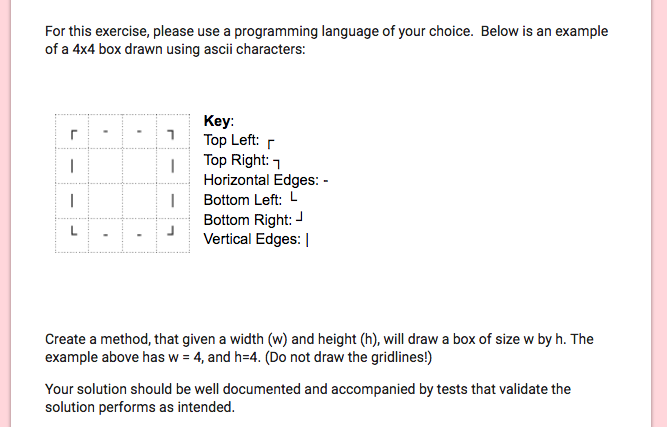

# grid-creator

## the rules:

## My Approach

First, I broke down the problem into logical steps, and came up with a set of rules:

1.  There will always be four corners to the grid, and so always only one of each of the corner ASCII characters.
2.  Once the width is greater than 2, the amount of horizontal edges to be printed will be the width - 2.
3.  Once the height is greater than 2, the amount of vertical edges to be printed will be the height - 2.
